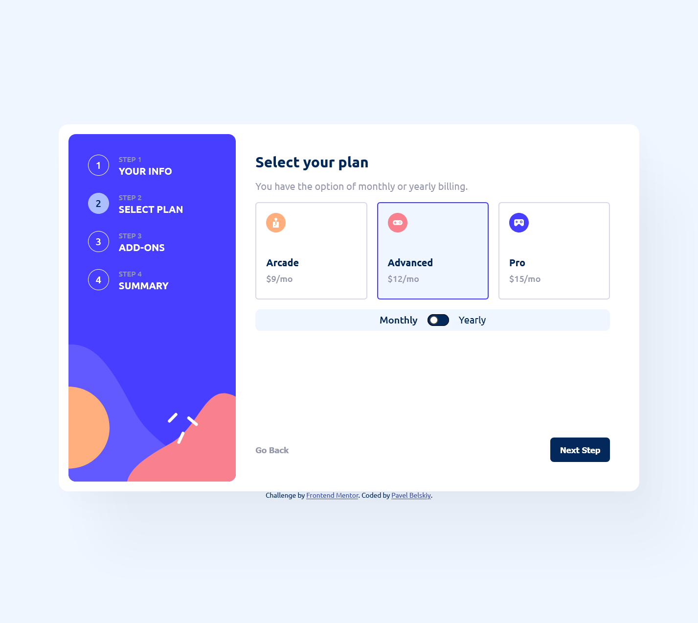
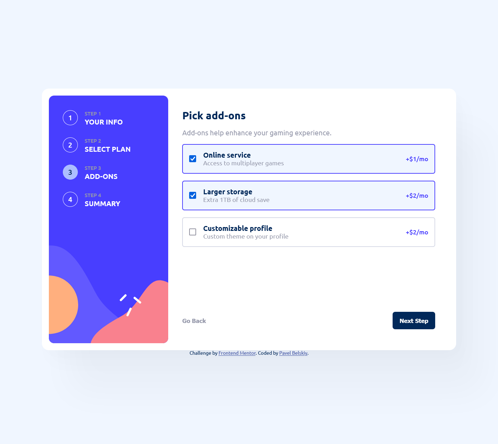
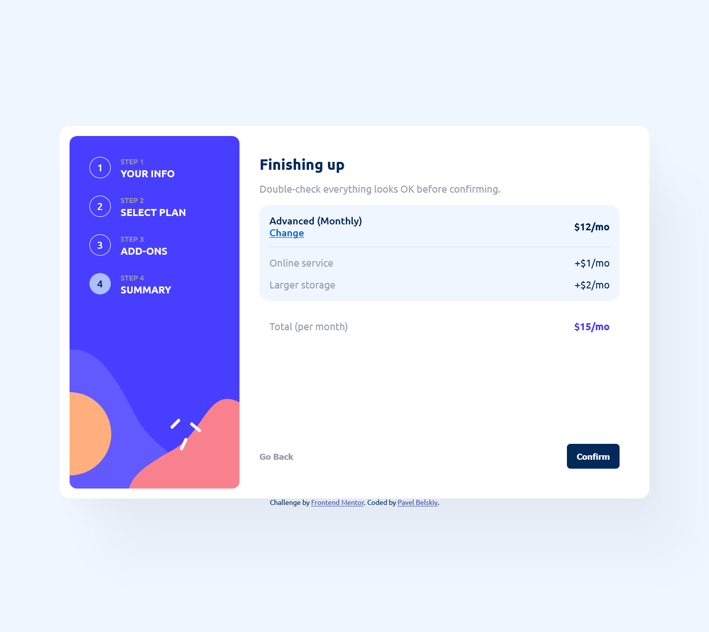

# Frontend Mentor - Multi-step form solution

This is a solution to the [Multi-step form challenge on Frontend Mentor](https://www.frontendmentor.io/challenges/multistep-form-YVAnSdqQBJ). Frontend Mentor challenges help you improve your coding skills by building realistic projects. 

## Table of contents

- [Overview](#overview)
  - [The challenge](#the-challenge)
  - [Screenshots](#screenshots)
  - [Links](#links)
- [My process](#my-process)
  - [Built with](#built-with)
  - [Approach](#approach)
  - [Continued development](#continued-development)
- [Author](#author)

## Overview

### The challenge

Users should be able to:

- Complete each step of the sequence
- Go back to a previous step to update their selections
- See a summary of their selections on the final step and confirm their order
- View the optimal layout for the interface depending on their device's screen size
- See hover and focus states for all interactive elements on the page
- Receive form validation messages if:
  - A field has been missed
  - The email address is not formatted correctly
  - A step is submitted, but no selection has been made

### Screenshots

### Links

- Solution URL: [This repository](https://github.com/Jagholin/multi-step)
- Live Site URL: [https://dynamic-tarsier-ee273d.netlify.app/](https://dynamic-tarsier-ee273d.netlify.app/)

## My process

### Built with

- pure CSS
- [Sass](https://sass-lang.com/) - CSS preprocessor
- [React](https://reactjs.org/) - JS library
- [react-hook-form](https://react-hook-form.com/) - React form library

### Approach

For this project I decided not to use component libraries like Material UI or Bootstrap. I wanted to practice my CSS skills and learn more about Sass. In my previous project, I used Formik for form validation, but this time I decided to try out react-hook-form.

The page components and the form are decoupled from each other by utilising [render props pattern](https://react.dev/reference/react/Children#calling-a-render-prop-to-customize-rendering).

The algorithm for generating summary page and some form pages take their data about available options from the [./src/models/plans.ts](./src/models/plans.ts) file. It is possible to add new plans or change the existing ones without changing the rest of the code.

### Continued development

I separated some UI components into their own files(RadioSelect and Switch), but some things could have been done better. For example, it is obvious that some styling is shared between them, so I could have designed a theming system for them or something like that. 

I also wanted to try following the [cube CSS](https://cube.fyi/) methodology, as it sounds interesting, but decided this time against it. I think it would be a good idea to try it out in the next project, as it would make my CSS feel more structured.

## Author

- Website - [https://www.flyingsquirrels.de](https://www.flyingsquirrels.de)
- Frontend Mentor - [@Jagholin](https://www.frontendmentor.io/profile/Jagholin)
